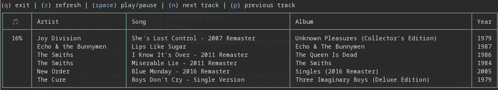

# spotnet

Some experimental Spotify stuff with .NET. (**Always a work in progress**)

## Spotify API

* Spotify developer dashboard: https://developer.spotify.com/dashboard
* Spotify API docs: https://developer.spotify.com/documentation/web-api

## Running the application

### Set up Spotify client credentials

enable secret storage for the web service by running the following from the `./src/web` directory

```bash
dotnet user-secrets init
```

add auth secrets

```bash
dotnet user-secrets set "Authentication:Spotify:ClientId" "<client-id>"
dotnet user-secrets set "Authentication:Spotify:ClientSecret" "<client-secret>"
```

### Get a Spotify auth token

* Run the ``./src/web`` app and then navigate to http://localhost:5130/login
* Sign in to Spotify
* The browser will then redirect to /loggedIn and the Spotify access token will be saved

*(tokens are stored in the `{Environment.SpecialFolder.ApplicationData}/spotnet` directory)*

### Run the CLI

After getting a token, run the `./src/cli` app. 

The cli knows about the token storage directory and takes care of refreshing expired tokens.

### Publish a binary

Publish as self-contained and then create a soft link to the binary in your $HOME/bin directory

`dotnet publish src/cli --self-contained --output $HOME/bin/SpotNet && ln -s $HOME/bin/SpotNet/SpotNet.Cli $HOME/bin/spotnet`

After that ^ you can run `spotnet <username>` from anywhere *(assuming $HOME/bin is on your PATH and you have acquired a Spotify auth token - see above)*.

### Screenshot!

